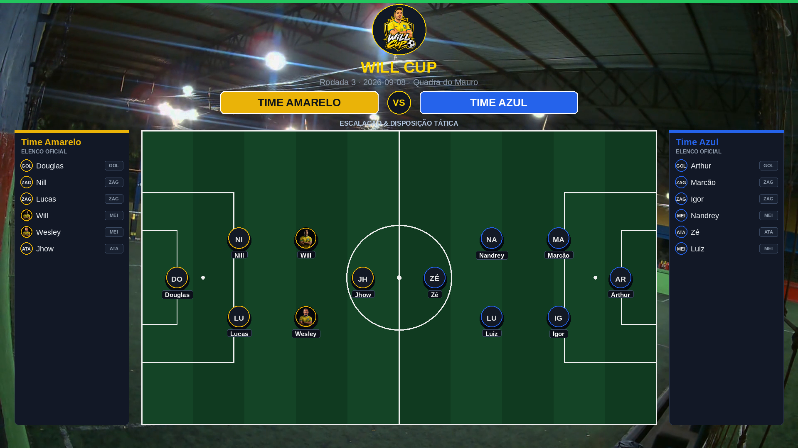
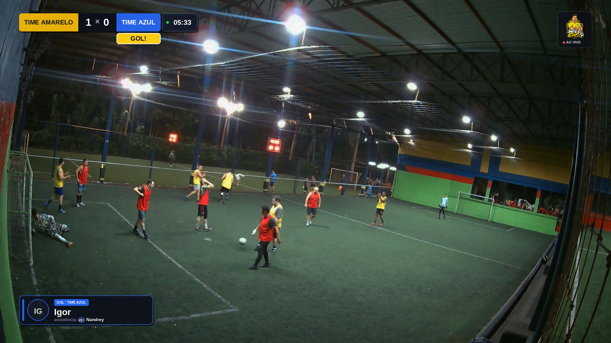
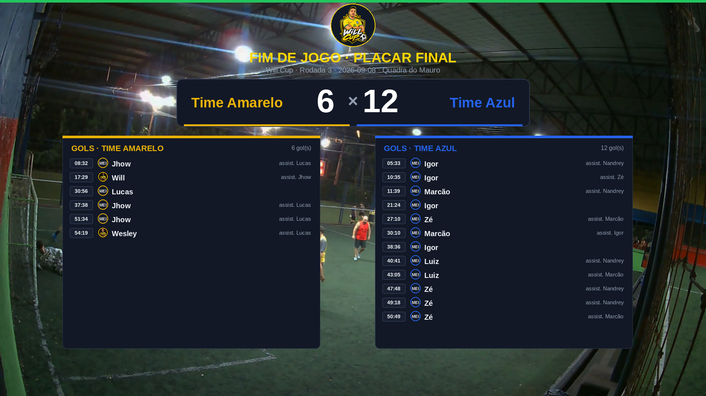
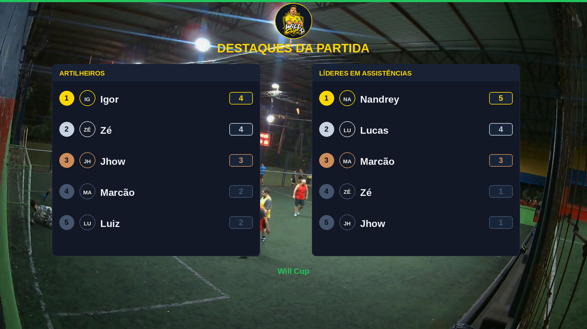
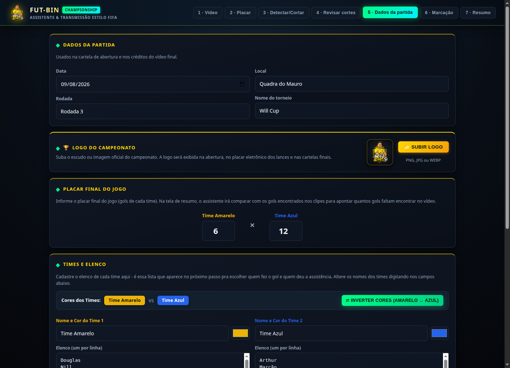
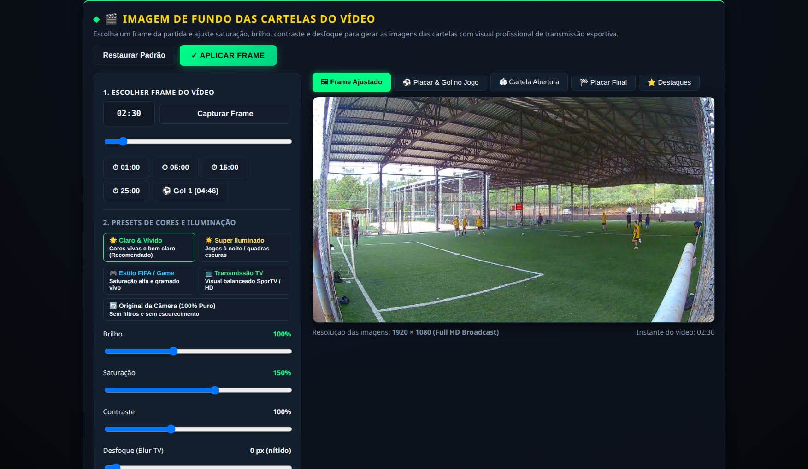

# Melhores Momentos — Pelada

Sistema para transformar a gravação completa de uma pelada num vídeo de melhores momentos com gols, autores, assistências e estatísticas.

Entrada: um vídeo de ~1h de câmera fixa.
Saída: um vídeo de 5–6 min com abertura, os lances, cartela em cada gol e fechamento com artilheiros.

Tempo de trabalho manual por jogo: cerca de 40 minutos.

---

## 📺 Visual das Telas — Estilo Transmissão de TV & FIFA Cardgame

O vídeo final é montado automaticamente em **Full HD 1080p** com visual profissional de transmissão esportiva, logo oficial do campeonato, fotos dos jogadores e cores vivas:

### 1. Abertura Oficial com Escalação Tática e Fotos
Logo oficial do campeonato, confronto com cores personalizadas e campinho tático com avatares dos jogadores.


### 2. Placar Dinâmico e Faixa de Gol no Jogo (Compacta & Elegante)
Durante a partida: placar eletrônico com tempo no topo esquerdo, logo oficial "AO VIVO" no topo direito e card flutuante compacto de celebração de gol (autor, mini-foto do assistente e time) sem poluir o campo.


### 3. Placar Final (Fim de Jogo)
Placar final com todos os gols marcados, minutos de cada gol e assistências.


### 4. Destaques da Partida (Artilheiros & Assistências)
Ranking com os artilheiros do jogo e líderes em assistências com medalhas de ouro, prata e bronze.


### 5. Assistente Web — Estilo FIFA & Presets em 1 Clique
Interface moderna no navegador com tema escuro esportivo, upload de logo do torneio, fotos dos jogadores e ajustes de imagem (saturação, brilho e presets como *Claro & Vívido*, *Estilo FIFA* e *Super Iluminado*).



---

## Índice

0. [Visual das Telas (Exemplos)](#-visual-das-telas--estilo-transmissão-de-tv--fifa-cardgame)
1. [Assistente no navegador (recomendado)](#assistente-no-navegador-recomendado)
2. [Como funciona](#como-funciona)
3. [O que você precisa](#o-que-você-precisa)
4. [Instalação](#instalação)
5. [Fluxo completo (manual, avançado)](#fluxo-completo)
6. [Os scripts, um a um](#os-scripts-um-a-um)
7. [Como filmar para facilitar](#como-filmar-para-facilitar)
8. [Problemas comuns](#problemas-comuns)
9. [O que não funcionou e por quê](#o-que-não-funcionou-e-por-quê)

---

## Assistente no navegador (recomendado)

Em vez de rodar os 4 scripts na mão e editar `gols.txt`/`placar.json` no Paint, o
assistente local faz o passo a passo inteiro numa página só:

```bash
# Linux / macOS
./run.sh site

# Windows (Prompt de Comando ou duplo clique em run.bat)
run.bat site

# Windows (PowerShell)
.\run.ps1 site
```

Abre `http://127.0.0.1:8000` automaticamente e guia por 7 passos:

1. **Vídeo** — navega pelas pastas do computador (um seletor tipo explorador de arquivos,
   começando em `~/Vídeos` ou `~/Downloads` se existirem) e clica no vídeo do jogo - não precisa
   mover/copiar o arquivo pra dentro do projeto.
2. **Placar** — carrega um frame do meio do jogo e você arrasta um retângulo em volta do placar
   direto na tela (substitui o Paint + `placar.json` na mão).
3. **Detectar e cortar** — um botão só: roda a detecção automática (mesmo motor do
   `detectar_gols.py`) e já corta os clipes em seguida, sem passo intermediário.
4. **Revisar os cortes** — assiste cada clipe de verdade (não só o placar) pra confirmar se foi
   gol mesmo; descarta com um clique o que não for (remove da lista e apaga o arquivo). Se faltou
   algum gol, dá pra adicionar manualmente vendo o placar ampliado em qualquer instante do vídeo -
   ele entra no próximo corte sem perder os clipes já revisados. Pra lances que não são gol (ou pra
   ajustar o começo/fim exato de um lance), a seção **"Cortar várias jogadas de uma vez"** deixa
   digitar início e fim (mm:ss) de quantas jogadas quiser numa lista e corta todas de uma vez, com a
   região exata escolhida - sem depender da janela fixa usada pros gols.
5. **Marcação** — pra cada clipe, digita quem fez o gol e quem deu assistência (texto livre, sem
   precisar cadastrar elenco antes) - os clipes já vêm carregados sozinhos (sem selecionar
   arquivo) e tudo é salvo automaticamente a cada clique.
6. **Dados da partida** — data, competição, local, nome de cada time (com cor) e o elenco
   completo de cada um (opcional) - só usados na cartela de abertura e nos créditos do vídeo
   final, não afetam os nomes já digitados na marcação.
7. **Resumo & montagem** — placar, artilheiros, cronologia, e o botão que monta o vídeo final e
   mostra o resultado pronto pra baixar.

**Onde fica o vídeo**: em qualquer pasta do seu computador - o navegador de pastas do passo 1
alcança o disco inteiro (a mesma conta que roda o `./run.sh site`). O assistente lê o arquivo
direto do disco - **não existe upload pela rede**: como o servidor roda na sua própria máquina,
mandar um vídeo de vários GB pela rede seria só perda de tempo. Se preferir manter os jogos
organizados dentro do projeto, uma pasta `videos/` (crie se quiser) aparece como atalho rápido
no topo do passo 1, mas não é obrigatória.

As etapas pesadas (detecção, corte, montagem) continuam sendo os mesmos scripts de sempre, só que
chamados em segundo plano com o log ao vivo na tela em vez de precisar abrir terminal. Se preferir
o fluxo manual (útil pra depurar um caso difícil olhando `ranking_picos.txt`/`contato_placar.png`
direto), ele continua funcionando normalmente - ver [Fluxo completo](#fluxo-completo) abaixo.

---

## Como funciona

O sistema tem quatro etapas encadeadas. Cada uma gera um arquivo que a seguinte consome, então dá para refazer uma sem refazer todas.

| Etapa | O que faz | Manual? | Saída |
|---|---|---|---|
| 1 | Achar os momentos de gol | 10 min | `gols.json` |
| 2 | Cortar os clipes | automático | `gols/clipes/*.mp4` |
| 3 | Marcar autor e assistência | 20 min | `partida.json` |
| 4 | Montar o vídeo final | automático | `melhores_momentos.mp4` |

A **etapa 1** é a única que exige olho humano hoje, e existe por um motivo concreto explicado em [Como filmar](#como-filmar-para-facilitar): se o placar aparecer grande o suficiente na gravação, ela vira automática.

A **etapa 3** sempre vai exigir uma pessoa. Nem os sistemas profissionais de transmissão resolvem "quem fez o gol" automaticamente sem infraestrutura de estádio — eles usam escalação prévia, números nas camisas e um scout humano marcando ao vivo.

---

## O que você precisa

**Da gravação**
- Vídeo do jogo inteiro, câmera **fixa** (não pode ser panorâmica nem seguir a bola)
- Placar eletrônico visível no quadro
- 1080p já basta; resolução maior não ajuda

**Do computador**
- Windows, macOS ou Linux
- Python 3.10 ou mais novo
- ffmpeg
- ~5 GB livres por jogo
- **Não precisa de GPU**

**Da informação**
- Nomes dos jogadores divididos nos dois times
- Placar final (ajuda a conferir se nada escapou)

---

## Instalação

### Windows

Basta ter o **Python** e o **ffmpeg** instalados no sistema:

```powershell
# 1. Python — https://www.python.org/downloads/ (marcar "Add python.exe to PATH")
# ou pelo terminal:
winget install Python.Python.3.12

# 2. ffmpeg
winget install Gyan.FFmpeg
# feche e reabra o terminal para atualizar o PATH
```

Depois disso, você **não precisa criar nem ativar ambiente virtual manualmente**: o `run.bat` (ou `run.ps1`) cria o `.venv/`, instala o `requirements.txt` e roda tudo automaticamente.

- **Pelo Explorador de Arquivos**: dê duplo clique em `run.bat` (inicia um menu interativo que abre o assistente).
- **Pelo Prompt de Comando (CMD)**: `run.bat site`
- **Pelo PowerShell**: `.\run.ps1 site`

### macOS / Linux

```bash
brew install ffmpeg           # ou: sudo apt install ffmpeg
```

O `./run.sh` cuida do ambiente virtual e das dependências automaticamente.

### Atalhos de execução (`run.bat`, `run.ps1` e `run.sh`)

Em vez de criar ambiente na mão, use os scripts que cuidam de tudo sozinhos:

```bash
# Windows (CMD ou duplo clique no arquivo run.bat):
run.bat site              # recomendado: assistente completo no navegador
run.bat folha_placar --source_video_path pelada.mp4 --fim 58:23 --intervalo 10
run.bat detectar_gols --source_video_path pelada.mp4 --cortar --output_dir gols
run.bat montar_video --partida partida.json --clipes gols/clipes
run.bat marcador          # abre o marcador.html no navegador padrão
run.bat                   # menu interativo de comandos

# Windows (PowerShell):
.\run.ps1 site
.\run.ps1 detectar_gols --source_video_path pelada.mp4 --cortar --output_dir gols

# Linux / macOS:
./run.sh tray              # recomendado: servidor com ícone na bandeja do sistema
./run.sh site              # assistente no navegador
./run.sh stop              # para o servidor e fecha a bandeja
./run.sh status            # exibe PIDs e uso de memória em tempo real
./run.sh folha_placar --source_video_path pelada.mp4 --fim 58:23 --intervalo 10
./run.sh detectar_gols --source_video_path pelada.mp4 --cortar --output_dir gols
./run.sh montar_video --partida partida.json --clipes gols/clipes
./run.sh marcador
./run.sh                   # lista os comandos disponíveis
```

`ffmpeg` continua sendo dependência do sistema (não instalada pelos scripts) — veja acima.

### Arquivos do projeto

Coloque todos numa pasta só, junto com o vídeo:

```
fut-bin/
├── run.bat                 atalho Windows (CMD / duplo clique no Explorer)
├── run.ps1                 atalho Windows (PowerShell)
├── run.sh                  atalho Linux / macOS (bash)
├── fut-bin.desktop         lançador com ícone para o sistema operacional / menu de aplicativos
├── tray.py                 bandeja do sistema (StatusNotifierItem) com controle e monitor de RAM
├── requirements.txt        dependências (opencv, numpy, tqdm, pillow, fastapi, uvicorn, setproctitle)
├── assistente_web.py      backend do assistente no navegador (`run.bat site` / `./run.sh site`)
├── web/assistente.html    frontend do assistente (passo a passo único)
├── detectar_gols.py       corta os clipes / detecção automática
├── folha_placar.py        folhas de contato do placar (fluxo manual)
├── montar_video.py        monta o vídeo final
├── marcador.html          app de marcação isolado, sem servidor (fluxo manual)
├── diagnosticar_placar.py conferência da região do placar
└── videos/                 opcional: atalho rápido no assistente - o vídeo pode ficar em qualquer pasta
```

---

## Fluxo completo

### Passo 0 — Localizar o placar no quadro

Feito **uma vez por câmera**. Se a câmera não mudar de lugar entre os jogos, reaproveita.

Extraia um frame do meio do jogo:

```powershell
ffmpeg -y -ss 00:30:00 -i pelada.mp4 -frames:v 1 -update 1 frame.png
```

Abra no Paint (`mspaint frame.png`), dê zoom no placar e anote duas coordenadas — o Paint mostra a posição do cursor no canto inferior esquerdo:

- canto **superior esquerdo** dos dígitos do placar
- canto **inferior direito** dos mesmos dígitos

> Marque **só a linha do placar**. Se o display tiver cronômetro, deixe-o de fora — ele muda a cada segundo e atrapalha.

Com os números `(x1,y1)` e `(x2,y2)`, grave com 2 pixels de folga:

```powershell
[IO.File]::WriteAllText("$PWD\placar.json", '{"placar": [x1-2, y1-2, x2-x1+4, y2-y1+4]}')
```

Exemplo real: cantos em `1023,103` e `1047,123` viram `[1021, 101, 28, 24]`.

Confira antes de seguir:

```powershell
ffmpeg -y -ss 00:30:00 -i pelada.mp4 -frames:v 1 -update 1 -vf "crop=28:24:1021:101,scale=560:480:flags=neighbor" conf.png
```

O `conf.png` tem que mostrar **só os dois números do placar**, ocupando quase toda a imagem. Ajuste os valores até ficar assim — esse passo é o que mais influencia o resultado.

---

### Passo 1 — Achar os gols

```powershell
python folha_placar.py --source_video_path pelada.mp4 --fim 58:23 --intervalo 10
```

`--fim` é o apito final. Use `--inicio` também se o vídeo começar antes do jogo.

Gera imagens em `folhas/`, uma por 10 minutos de jogo, com o placar a cada 10 segundos, ampliado 7× e com o horário em cada miniatura.

**Percorra olhando só o segundo número de cada par.** Quando ele mudar, anote o horário da primeira miniatura que já mostra o valor novo. Leva uns 10 minutos.

Monte um `gols.txt`, um horário por linha:

```
01:50
05:00
09:20
11:20
```

Confira contra o placar final: o número de linhas deve bater com o total de gols. Se faltar, tem gol não anotado — procure nos trechos onde o intervalo entre anotações ficou muito maior que a média.

Converta:

```powershell
python folha_placar.py --source_video_path pelada.mp4 --tempos gols.txt --output_dir gols
```

---

### Passo 2 — Cortar os clipes

```powershell
Remove-Item gols\clipes -Recurse -Force -ErrorAction SilentlyContinue
python detectar_gols.py --source_video_path pelada.mp4 --cortar --output_dir gols
```

> A limpeza antes evita misturar clipes de rodadas anteriores. Sem ela você acaba revisando arquivos velhos.

Gera `gols/clipes/gol_01.mp4` em diante. Cada clipe pega 30s antes e 5s depois do horário anotado — folga proposital, porque o placar é atualizado depois do gol.

Se os gols estiverem saindo cortados, ajuste `ANTES_S` no topo do `folha_placar.py`, refaça a conversão e corte de novo. O vídeo não é reprocessado, só os cortes.

---

### Passo 3 — Marcar autor e assistência

Abra o `marcador.html` no navegador. É um arquivo único, sem servidor, e **os vídeos nunca saem da sua máquina**.

**Aba 1 — Partida.** Data, competição, local, nomes e cores dos times, e os jogadores (um por linha, ou botão "Colar elenco" para colar uma lista pronta). Carregue o `gols/gols.json` e selecione todos os mp4 de `gols/clipes`.

**Aba 2 — Marcação.** Uma fileira de chips no topo, um por clipe. Para cada um:

| Tecla | Ação |
|---|---|
| `G` | é gol → escolha time, autor, assistência |
| `L` | é lance → escolha o tipo e o destaque |
| `D` | descartar |
| `Enter` | salvar e avançar |
| `←` `→` | navegar |
| `R` | repetir o clipe |

**Gol** conta no placar e ganha cartela com nome. **Lance** entra no vídeo como melhor momento sem contar placar. **Descartar** tira do vídeo.

**Aba 3 — Resumo.** Placar calculado, pódio de artilheiros e garçons, cronologia. Compare o placar com o real — se não bater, algum gol escapou na etapa 1.

Clique em **Baixar partida.json**. Salve na pasta do projeto.

Tudo é salvo automaticamente enquanto você marca, então pode fechar e voltar depois.

---

### Passo 4 — Montar o vídeo

```powershell
python montar_video.py --partida partida.json --clipes gols/clipes
```

Sai em `final/melhores_momentos.mp4`. Uns 3 minutos de processamento.

Estrutura: abertura com nome da pelada, data, placar e os dois elencos; os lances em ordem cronológica, cada um com faixa inferior mostrando autor, assistência, time e minuto; fechamento com a cronologia dos gols e o pódio de artilheiros e assistências. Transição por fade entre segmentos.

Opções:

| Flag | Efeito |
|---|---|
| `--abertura 10` | segundos da cartela inicial |
| `--fechamento 12` | segundos das cartelas finais |
| `--roteiro 2,5,9` | monta só os clipes escolhidos em ordem |
| `--sem_abertura` | remove a cartela inicial |
| `--sem_fechamento` | remove as cartelas finais |
| `--sem_audio` | silencia os clipes |
| `--saida caminho.mp4` | outro arquivo de saída |

---

## Os scripts, um a um

### `folha_placar.py`

Dois modos. Sem `--tempos`, gera as folhas de contato para revisão. Com `--tempos`, converte os horários anotados em `gols.json`.

```
--intervalo 10     segundos entre miniaturas (5 dá o dobro de precisão e o dobro de trabalho)
--inicio / --fim   janela do jogo, aceita "8:40" ou "1:07:08"
```

Constantes no topo: `ZOOM` (ampliação), `ANTES_S` e `DEPOIS_S` (janela do corte).

### `detectar_gols.py`

Faz os cortes com ffmpeg a partir do `gols.json`. Também tem um modo de **detecção automática** do placar, que só funciona se os dígitos tiverem uns 25 pixels ou mais:

```powershell
python detectar_gols.py --source_video_path pelada.mp4 --fim 58:23 --fixo --gols 23 --output_dir gols
```

`--gols N` recebe o número de gols do placar final e usa segmentação para achar as N mudanças mais fortes — sem limiar para calibrar. `--fixo` desliga o rastreio do placar, que só serve se a câmera se mexer durante o jogo.

Sempre confira o `contato_placar.png` gerado: cada linha mostra o placar antes e depois de cada mudança detectada. Se os pares mostrarem o mesmo valor, a detecção não funcionou e o caminho é a folha de contato.

### `marcador.html`

App de marcação. Arquivo único, roda offline. Guarda o progresso automaticamente. Exporta `partida.json` (para a montagem) e um resumo em texto (para colar num site ou grupo).

### `montar_video.py`

Gera as cartelas com PIL e monta tudo com ffmpeg. Cores, fontes e tamanhos ficam nas constantes do topo — as cores dos times vêm do `partida.json`.

### `diagnosticar_placar.py`

Conferência. Gera um filmstrip do placar ao longo do jogo e mede a estabilidade da assinatura. Útil quando a detecção automática não fecha e você quer saber se o problema é a região, a cintilação do LED ou a legibilidade.

```powershell
python diagnosticar_placar.py --source_video_path pelada.mp4 --intervalo 67 --media 15
```

---

## Como filmar para facilitar

Estes pontos vieram de tentativa e erro em duas gravações. Cada um elimina um problema real que custou horas.

**Câmera fixa e bem presa.** Numa das gravações a câmera cedeu 35 pixels ao longo do jogo, o que fez a região do placar sair de cima dos dígitos na metade da partida. Quadra coberta costuma ter estrutura metálica que serve de fixação.

**Altura.** Quanto mais alto, menos jogador tapa jogador. Seis metros é um bom alvo, e o telhado de quadra coberta já entrega isso de graça.

**Placar grande no quadro.** O item mais importante para automatizar. Com dígitos de ~5 pixels a detecção automática é impossível; com ~25 pixels ela funciona sozinha. Se a câmera principal não consegue, um segundo celular filmando só o placar resolve — depois é só sincronizar pelo horário.

**Placar ligado antes do apito.** Display apagado no começo gera dezenas de detecções falsas.

**Sem contraluz no display.** Se o sol bater direto, os dígitos estouram e somem. Vale conferir o enquadramento no horário do jogo, não em outro.

**Grave com áudio.** A comemoração faz muita diferença no vídeo final.

**Quadra inteira no quadro.** Se a câmera pega só metade, você perde os gols do outro lado.

---

## Problemas comuns

**`conda` ou `python` não é reconhecido**
Falta no PATH. Reinstale o Python marcando "Add python.exe to PATH", ou use `venv` em vez de conda.

**`Activate.ps1` não pode ser carregado**
```powershell
Set-ExecutionPolicy -Scope CurrentUser -ExecutionPolicy RemoteSigned
```

**`&&` não é um separador válido**
PowerShell 5.1 não aceita. Rode uma linha por vez.

**`Unexpected UTF-8 BOM` ao ler o placar.json**
O `Out-File` do PowerShell grava BOM. Use:
```powershell
[IO.File]::WriteAllText("$PWD\placar.json", '{"placar": [x, y, w, h]}')
```

**`ffmpeg` não é reconhecido depois de instalar**
Feche e abra o terminal — o PATH só atualiza em sessões novas.

**`Invalid duration for option ss: 60:00`**
Não existe minuto 60. Use `01:00:00`.

**Saíram mais clipes do que gols anotados**
A pasta tinha arquivos de uma rodada anterior. Apague `gols/clipes` antes de cortar.

**O gol não aparece no clipe**
A janela está curta. Aumente `ANTES_S` no `folha_placar.py`, refaça a conversão e o corte.

**A janela do seletor de região abre preta**
Bug do OpenCV no Windows. Escreva o `placar.json` na mão com as coordenadas medidas no Paint.

---

## O que não funcionou e por quê

Vale registrar para ninguém repetir o caminho.

**Identificar jogadores por visão computacional.** Testado com `roboflow/sports` (YOLO + ByteTrack + SigLIP). Numa filmagem de câmera baixa, o tracker gerou **mais de 340 identidades para 14 pessoas** em 3 minutos — cerca de 24 trocas de identidade por jogador. A causa raiz foi recall de detecção em torno de 25%, derrubado por sombra dura e enquadramento ruim. Ajustar `imgsz` para 1920 e `conf` para 0,10 melhorou a detecção em 5,6×, mas o gargalo continua sendo altura de câmera e oclusão. Mesmo com tracking perfeito, o resultado seria dado posicional (mapa de calor, distância percorrida), nunca gol ou assistência.

**Calibrar o campo com o modelo de keypoints.** O modelo espera campo oficial de 11 (120×70m). Numa quadra society ele alucina pontos, o `findHomography` aceita numericamente, e as coordenadas saem sem relação com a realidade — 1803 de 1913 posições caíram fora do campo.

**Detectar gol pelo áudio da comemoração.** Recall bom (todos os gols confirmados apareceram entre os picos), precisão péssima: **1 gol em 20 clipes revisados**. O microfone da câmera fica perto de quem está sentado na lateral, e conversa próxima vence comemoração distante. Filtrar por energia sustentada por 3 segundos ajudou nos testes controlados mas não salvou o caso real.

**Detectar a mudança do placar automaticamente.** Funciona, mas depende do tamanho dos dígitos. Com ~5 pixels por dígito, mudar de `4` para `5` acende dois segmentos — menos pixels do que a variação causada por compressão e cintilação do LED. Em testes com dígitos de tamanho adequado, a segmentação acertou **4 de 4 no segundo exato**. É por isso que "enquadrar o placar maior" é a recomendação que mais muda o projeto.

**Detectar quem vai atualizar o placar.** Ideia promissora — uma pessoa mexe milhares de pixels, um dígito mexe cinco. Mas a área atrás do alambrado tem gente circulando o tempo todo, e o movimento do operador não se separa do trânsito normal.

**Mandar o vídeo inteiro para uma IA analisar.** Uma hora a 1 quadro por segundo dá 3.600 imagens, cerca de 5,4 milhões de tokens — muito acima da janela de contexto de qualquer modelo atual. Modelos com entrada de vídeo nativa aguentariam, mas amostram a ~1fps e não cravam timestamp. Mandar **só as folhas de contato do placar** funciona bem e é o que o passo 1 faz.

---

## Créditos e licença

Construído sobre ferramentas abertas: ffmpeg, OpenCV, NumPy, Pillow. A exploração inicial de visão computacional usou [roboflow/sports](https://github.com/roboflow/sports).

Use e adapte à vontade.
